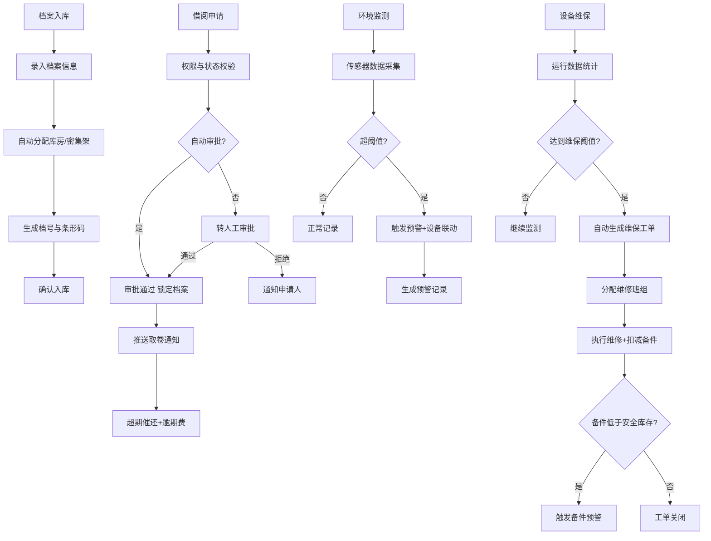

## 1. 产品概述

大型档案馆数字档案管理与智能库房调度桌面系统，面向政府机关、大型企事业单位档案馆，实现档案入库智能分配、借阅自动审批、库房环境实时监控、设备维保自动化管理、统计分析与可视化报告于一体的综合管理平台。目标用户为档案管理员、审批人员、库房运维人员和决策领导。

## 2. 核心功能

### 2.1 用户角色

| 角色 | 注册方式 | 核心权限 |
|------|----------|----------|
| 系统管理员 | 管理员创建 | 全部权限，用户管理、系统配置 |
| 档案管理员 | 管理员创建 | 档案入库、档号生成、库房分配、借阅审批 |
| 借阅用户 | 申请注册 | 提交借阅申请、查看个人借阅记录、预约档案 |
| 库房运维 | 管理员创建 | 环境监控、设备维保、备件管理 |
| 决策领导 | 管理员创建 | 查看统计报表、库房可视化、导出报告 |

### 2.2 功能模块

1. **仪表盘首页**: 系统概览、关键指标卡片、实时预警、快捷入口、库房平面图概览
2. **档案入库管理**: 档案登记、自动分配库房与密集架、生成档号与条形码、批量入库
3. **借阅审批管理**: 借阅申请、自动审批规则、档案锁定、取卷通知、催还流程、逾期费计算
4. **库房环境监测**: 温湿度/光照/有害气体实时监控、阈值预警、设备联动控制、预警记录
5. **设备维保管理**: 设备台账、维保工单自动生成、维修班组分配、备件库存与预警
6. **统计分析报告**: 借阅量/利用率/库容统计、月度报告导出(PDF/Excel)、库房热力图

### 2.3 页面详情

| 页面名称 | 模块名称 | 功能描述 |
|----------|----------|----------|
| 仪表盘首页 | 指标卡片 | 显示档案总量、在库数量、借出数量、预警数量等核心指标 |
| 仪表盘首页 | 实时预警 | 显示最近环境预警、超期未还、设备故障等预警信息列表 |
| 仪表盘首页 | 库房平面图 | 2D平面图展示库房区域分布，各区域温湿度热力叠加 |
| 仪表盘首页 | 快捷操作 | 入库登记、借阅申请、环境查看、报告导出等快捷入口 |
| 档案入库管理 | 档案登记表单 | 录入档案类型、保密等级、载体材质、全宗、年度等信息 |
| 档案入库管理 | 智能分配 | 根据规则自动推荐最优库房与密集架位置，支持手动调整 |
| 档案入库管理 | 档号与条形码 | 自动生成唯一档号，生成可打印条形码标签 |
| 档案入库管理 | 入库列表 | 分页展示已入库档案，支持多条件筛选与搜索 |
| 借阅审批管理 | 借阅申请 | 借阅用户提交申请，选择档案、预约时间、借阅用途 |
| 借阅审批管理 | 自动审批 | 系统根据权限、档案状态、预约时间自动审批或转人工 |
| 借阅审批管理 | 取卷通知 | 审批通过后推送取卷通知，显示库房位置与密集架号 |
| 借阅审批管理 | 催还管理 | 超期自动触发催还通知，累计逾期费用，支持批量催还 |
| 借阅审批管理 | 借阅记录 | 完整借阅流水记录，支持按用户/档案/时间筛选 |
| 库房环境监测 | 实时数据面板 | 各传感器实时温湿度、光照、有害气体数据展示 |
| 库房环境监测 | 阈值配置 | 设置各库房环境参数阈值，超阈值触发预警与设备联动 |
| 库房环境监测 | 设备联动 | 自动控制除湿机、加湿机、通风设备启停 |
| 库房环境监测 | 预警记录 | 历史预警记录查询，包含触发时间、参数、处理结果 |
| 设备维保管理 | 设备台账 | 所有设备列表，显示运行时长、开关次数、状态 |
| 设备维保管理 | 维保工单 | 按运行时长/开关次数自动生成维保工单，支持手动创建 |
| 设备维保管理 | 维修班组 | 班组管理与工单分配，班组工作量统计 |
| 设备维保管理 | 备件库存 | 备件出入库管理，低于安全库存自动预警 |
| 统计分析报告 | 借阅统计 | 按全宗/年度/利用方式统计借阅量 |
| 统计分析报告 | 利用率分析 | 档案利用率、库容占用率图表分析 |
| 统计分析报告 | 报告导出 | 月度运行报告导出为PDF或Excel |
| 统计分析报告 | 热力图 | 库房平面图叠加温湿度热力与档案流转状态 |

## 3. 核心流程

### 3.1 档案入库流程
档案管理员录入档案信息（类型、保密等级、载体材质）→ 系统根据分配规则匹配最优库房与密集架 → 自动生成唯一档号 → 生成条形码 → 确认入库 → 更新库容数据

### 3.2 借阅审批流程
借阅用户提交借阅申请 → 系统校验用户权限与档案状态 → 符合自动审批规则则自动通过，否则转人工 → 审批通过后锁定档案 → 推送取卷通知（含库房位置与密集架号）→ 用户取卷 → 归还时解锁 → 超期未还自动触发催还流程并累计逾期费

### 3.3 环境监控流程
传感器实时采集温湿度/光照/有害气体数据 → 系统比对阈值 → 超阈值触发预警 → 自动联动对应设备（除湿/加湿/通风）→ 生成预警记录 → 环境恢复正常后自动关闭联动设备

### 3.4 设备维保流程
系统监测设备运行时长与开关次数 → 达到维保阈值自动生成维保工单 → 分配维修班组 → 执行维修并扣减备件库存 → 备件低于安全库存触发预警 → 工单完成关闭

## 4. 用户界面设计

### 4.1 设计风格
- **主色调**: 深蓝灰色(#1B2A4A)搭配琥珀色(#D4A843)点缀，体现档案馆沉稳专业气质
- **辅助色**: 冷灰(#64748B)为中性色调，翡翠绿(#10B981)为正常状态，珊瑚红(#EF4444)为预警状态
- **按钮风格**: 圆角(8px)微立体按钮，主按钮深蓝底白字，次按钮描边风格
- **字体**: 标题使用 Noto Serif SC（衬线体体现文化气质），正文使用 Noto Sans SC
- **布局风格**: 左侧固定导航栏 + 顶部面包屑 + 右侧内容区域，卡片式布局
- **图标风格**: 线性图标(lucide-react)，统一24px尺寸

### 4.2 页面设计概览

| 页面名称 | 模块名称 | UI元素 |
|----------|----------|--------|
| 仪表盘首页 | 指标卡片 | 4列网格卡片，数字大字体+小标签，带趋势箭头图标 |
| 仪表盘首页 | 实时预警 | 列表组件，红色/黄色/蓝色标签区分预警等级 |
| 仪表盘首页 | 库房平面图 | 2D SVG平面图，区域色块叠加热力渐变 |
| 档案入库管理 | 登记表单 | 分步表单，步骤条指示器，下拉选择+日期选择 |
| 档案入库管理 | 智能分配 | 库房/密集架树形选择器，推荐位置高亮显示 |
| 档案入库管理 | 条形码 | 条形码组件，支持打印预览 |
| 借阅审批管理 | 审批列表 | 表格+状态标签(待审批/已通过/已拒绝)，操作按钮列 |
| 借阅审批管理 | 催还通知 | 弹窗通知，逾期天数与费用醒目显示 |
| 库房环境监测 | 实时面板 | 仪表盘式数据卡片，数值+单位+趋势折线迷你图 |
| 库房环境监测 | 预警记录 | 时间线式记录列表，附处理状态标签 |
| 设备维保管理 | 工单卡片 | 看板式工单管理(待处理/进行中/已完成三列) |
| 统计分析报告 | 图表 | 柱状图+折线图+饼图组合，支持时间范围筛选 |
| 统计分析报告 | 热力图 | 库房平面图+温湿度热力渐变叠加+流转箭头动画 |

### 4.3 响应式设计
- 桌面优先设计，最小支持1280px宽度
- 导航栏在1200px以下折叠为图标模式
- 卡片网格在窄屏下自动减少列数
- 表格在窄屏下支持横向滚动

### 4.4 3D场景指引
- 不涉及3D场景，使用2D SVG平面图实现库房可视化
