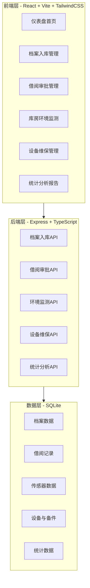
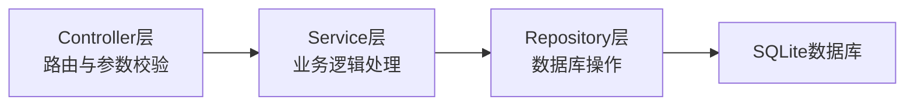
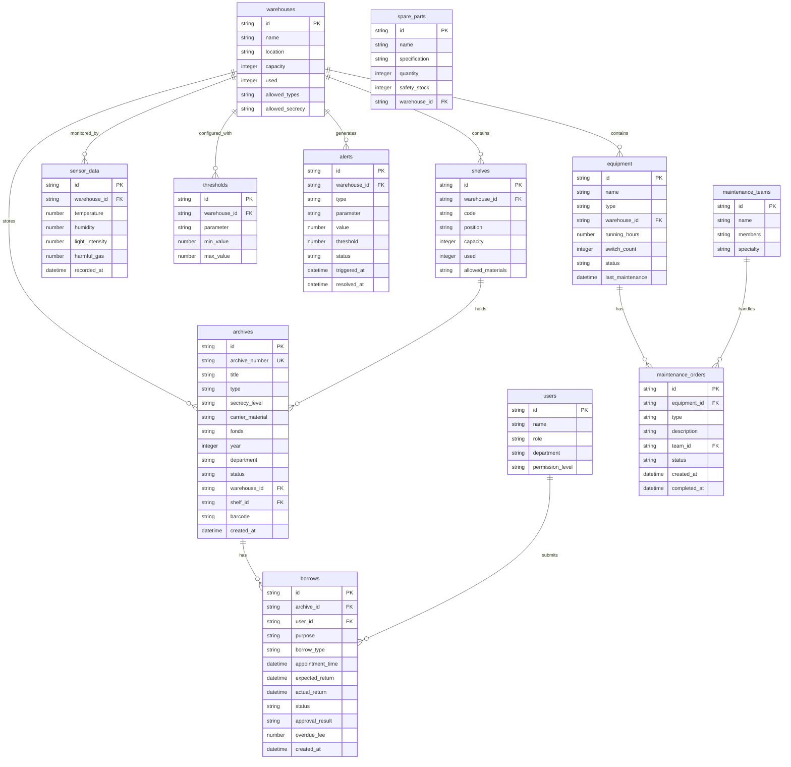

## 1. 架构设计



## 2. 技术说明

- **前端**: React@18 + TailwindCSS@3 + Vite + Zustand（状态管理）+ Recharts（图表）+ JsBarcode（条形码）
- **初始化工具**: vite-init
- **后端**: Express@4 + TypeScript (ESM格式)
- **数据库**: SQLite (better-sqlite3)，Mock数据填充
- **路由**: react-router-dom v6
- **图标**: lucide-react
- **导出**: jspdf + xlsx（PDF/Excel导出）

## 3. 路由定义

| 路由 | 用途 |
|------|------|
| / | 仪表盘首页，系统概览与快捷入口 |
| /archive/intake | 档案入库管理，登记与分配 |
| /archive/list | 档案列表查询 |
| /borrow/apply | 借阅申请 |
| /borrow/approval | 借阅审批管理 |
| /borrow/records | 借阅记录与催还 |
| /environment/monitor | 库房环境实时监测 |
| /environment/alerts | 环境预警记录 |
| /environment/threshold | 阈值配置 |
| /equipment/list | 设备台账 |
| /equipment/maintenance | 维保工单管理 |
| /equipment/spare-parts | 备件库存管理 |
| /statistics/borrowing | 借阅统计分析 |
| /statistics/utilization | 利用率与库容分析 |
| /statistics/report | 月度报告导出 |
| /warehouse/map | 库房平面图与热力图 |

## 4. API定义

### 4.1 档案入库API

```typescript
// POST /api/archives - 创建档案（入库）
interface CreateArchiveRequest {
  title: string
  type: "文书" | "科技" | "会计" | "人事" | "声像" | "电子"
  secrecyLevel: "公开" | "内部" | "秘密" | "机密"
  carrierMaterial: "纸质" | "胶片" | "磁带" | "光盘" | "硬盘"
  fonds: string
  year: number
  department: string
  description?: string
}

interface CreateArchiveResponse {
  id: string
  archiveNumber: string
  warehouseId: string
  warehouseName: string
  shelfId: string
  shelfPosition: string
  barcode: string
}

// GET /api/archives - 档案列表
interface ArchiveListQuery {
  page?: number
  pageSize?: number
  type?: string
  secrecyLevel?: string
  keyword?: string
  status?: "在库" | "借出" | "锁定"
}

// GET /api/archives/:id - 档案详情
```

### 4.2 借阅审批API

```typescript
// POST /api/borrows - 提交借阅申请
interface CreateBorrowRequest {
  archiveId: string
  purpose: string
  borrowType: "阅览" | "外借" | "复制"
  appointmentTime: string
  expectedReturnDate: string
}

interface BorrowApprovalResult {
  status: "auto_approved" | "pending_manual" | "rejected"
  reason?: string
}

// PUT /api/borrows/:id/approve - 人工审批
// POST /api/borrows/:id/return - 归还
// GET /api/borrows/overdue - 超期列表
// POST /api/borrows/:id/remind - 催还
```

### 4.3 环境监测API

```typescript
// GET /api/environment/realtime - 实时环境数据
interface EnvironmentData {
  warehouseId: string
  temperature: number
  humidity: number
  lightIntensity: number
  harmfulGas: number
  timestamp: string
}

// GET /api/environment/alerts - 预警记录
// PUT /api/environment/threshold - 设置阈值
// POST /api/environment/device-control - 设备联动控制
```

### 4.4 设备维保API

```typescript
// GET /api/equipment - 设备列表
// GET /api/equipment/maintenance - 维保工单列表
// POST /api/equipment/maintenance - 创建维保工单
// PUT /api/equipment/maintenance/:id - 更新工单状态
// GET /api/equipment/spare-parts - 备件库存
// POST /api/equipment/spare-parts/deduct - 扣减备件
```

### 4.5 统计分析API

```typescript
// GET /api/statistics/borrowing - 借阅统计
// GET /api/statistics/utilization - 利用率统计
// GET /api/statistics/warehouse-capacity - 库容统计
// GET /api/statistics/export/pdf - 导出PDF
// GET /api/statistics/export/excel - 导出Excel
```

## 5. 服务端架构图



## 6. 数据模型

### 6.1 数据模型定义



### 6.2 数据定义语言

```sql
CREATE TABLE users (
  id TEXT PRIMARY KEY,
  name TEXT NOT NULL,
  role TEXT NOT NULL CHECK(role IN ('admin','archivist','borrower','maintenance','leader')),
  department TEXT,
  permission_level TEXT DEFAULT 'normal',
  created_at DATETIME DEFAULT CURRENT_TIMESTAMP
);

CREATE TABLE warehouses (
  id TEXT PRIMARY KEY,
  name TEXT NOT NULL,
  location TEXT,
  capacity INTEGER DEFAULT 0,
  used INTEGER DEFAULT 0,
  allowed_types TEXT,
  allowed_secrecy TEXT
);

CREATE TABLE shelves (
  id TEXT PRIMARY KEY,
  warehouse_id TEXT NOT NULL REFERENCES warehouses(id),
  code TEXT NOT NULL,
  position TEXT,
  capacity INTEGER DEFAULT 0,
  used INTEGER DEFAULT 0,
  allowed_materials TEXT
);

CREATE TABLE archives (
  id TEXT PRIMARY KEY,
  archive_number TEXT UNIQUE NOT NULL,
  title TEXT NOT NULL,
  type TEXT NOT NULL,
  secrecy_level TEXT NOT NULL,
  carrier_material TEXT NOT NULL,
  fonds TEXT,
  year INTEGER,
  department TEXT,
  description TEXT,
  status TEXT DEFAULT '在库' CHECK(status IN ('在库','借出','锁定')),
  warehouse_id TEXT REFERENCES warehouses(id),
  shelf_id TEXT REFERENCES shelves(id),
  barcode TEXT,
  created_at DATETIME DEFAULT CURRENT_TIMESTAMP
);

CREATE TABLE borrows (
  id TEXT PRIMARY KEY,
  archive_id TEXT NOT NULL REFERENCES archives(id),
  user_id TEXT NOT NULL REFERENCES users(id),
  purpose TEXT,
  borrow_type TEXT NOT NULL,
  appointment_time DATETIME,
  expected_return DATETIME,
  actual_return DATETIME,
  status TEXT DEFAULT '待审批' CHECK(status IN ('待审批','已通过','已拒绝','借出中','已归还','已超期')),
  approval_result TEXT,
  overdue_fee REAL DEFAULT 0,
  created_at DATETIME DEFAULT CURRENT_TIMESTAMP
);

CREATE TABLE sensor_data (
  id TEXT PRIMARY KEY,
  warehouse_id TEXT NOT NULL REFERENCES warehouses(id),
  temperature REAL,
  humidity REAL,
  light_intensity REAL,
  harmful_gas REAL,
  recorded_at DATETIME DEFAULT CURRENT_TIMESTAMP
);

CREATE TABLE thresholds (
  id TEXT PRIMARY KEY,
  warehouse_id TEXT NOT NULL REFERENCES warehouses(id),
  parameter TEXT NOT NULL,
  min_value REAL,
  max_value REAL
);

CREATE TABLE alerts (
  id TEXT PRIMARY KEY,
  warehouse_id TEXT NOT NULL REFERENCES warehouses(id),
  type TEXT NOT NULL,
  parameter TEXT NOT NULL,
  value REAL,
  threshold REAL,
  status TEXT DEFAULT '未处理' CHECK(status IN ('未处理','处理中','已解决')),
  triggered_at DATETIME DEFAULT CURRENT_TIMESTAMP,
  resolved_at DATETIME
);

CREATE TABLE equipment (
  id TEXT PRIMARY KEY,
  name TEXT NOT NULL,
  type TEXT NOT NULL,
  warehouse_id TEXT REFERENCES warehouses(id),
  running_hours REAL DEFAULT 0,
  switch_count INTEGER DEFAULT 0,
  status TEXT DEFAULT '运行中' CHECK(status IN ('运行中','停机','维修中')),
  last_maintenance DATETIME
);

CREATE TABLE maintenance_orders (
  id TEXT PRIMARY KEY,
  equipment_id TEXT NOT NULL REFERENCES equipment(id),
  type TEXT NOT NULL,
  description TEXT,
  team_id TEXT REFERENCES maintenance_teams(id),
  status TEXT DEFAULT '待处理' CHECK(status IN ('待处理','进行中','已完成')),
  created_at DATETIME DEFAULT CURRENT_TIMESTAMP,
  completed_at DATETIME
);

CREATE TABLE maintenance_teams (
  id TEXT PRIMARY KEY,
  name TEXT NOT NULL,
  members TEXT,
  specialty TEXT
);

CREATE TABLE spare_parts (
  id TEXT PRIMARY KEY,
  name TEXT NOT NULL,
  specification TEXT,
  quantity INTEGER DEFAULT 0,
  safety_stock INTEGER DEFAULT 10,
  warehouse_id TEXT REFERENCES warehouses(id)
);

CREATE INDEX idx_archives_status ON archives(status);
CREATE INDEX idx_archives_type ON archives(type);
CREATE INDEX idx_borrows_status ON borrows(status);
CREATE INDEX idx_borrows_user ON borrows(user_id);
CREATE INDEX idx_sensor_warehouse ON sensor_data(warehouse_id);
CREATE INDEX idx_alerts_status ON alerts(status);
CREATE INDEX idx_equipment_warehouse ON equipment(warehouse_id);
CREATE INDEX idx_maintenance_status ON maintenance_orders(status);
